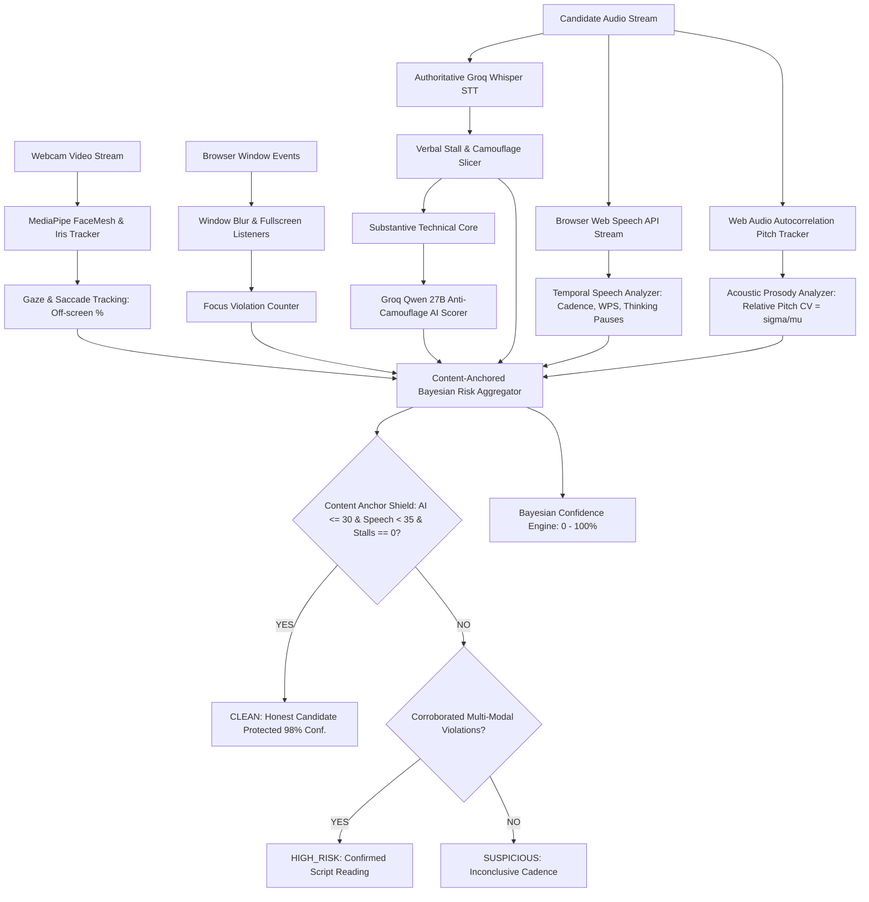

# Interview Integrity Engine 
### Real-Time Multi-Modal Anti-Cheating & AI Detection System for Live Technical Interviews

A zero-install, real-time interview integrity system designed to detect candidates secretly using modern AI tools (**ChatGPT, Claude, Perplexity, teleprompter HUDs, Cluely, secondary monitors, or audio earpieces**) during live video interviews.

Unlike legacy proctoring tools that merely check for browser tab switching, this engine combines **cognitive speech rhythm analysis**, **acoustic prosody**, **biometric eye tracking**, **verbal stall slicing**, and **anti-camouflage LLM evaluation** into a **Content-Anchored Bayesian Risk & Confidence Model**.

---

##  Why Traditional Proctoring Fails Against Modern AI Cheating

Modern technical interview cheaters do not trigger standard proctoring alerts:

| Cheating Technique | Why Legacy Proctoring Fails | How Interview Integrity Engine Catches It |
| :--- | :--- | :--- |
| **Secondary Monitor / Phone Stand** | The candidate never clicks outside the interview window. **Tab blur = 0, Fullscreen exits = 0.** | **MediaPipe Iris Gaze Tracking** detects off-screen glance clusters; **Temporal Speech Analyzer** flags unbroken recitation. |
| **Transparent Teleprompter HUD / Cluely** | A floating ChatGPT window is placed directly beneath the webcam. Gaze stays centered near the camera. | **Cognitive Speech Cadence**: Eye-voice coordination during reading produces an unbroken word stream with **near-zero thinking pauses**. |
| **Conversational AI Prompting** | Candidates prompt ChatGPT to *"answer like a pragmatic senior engineer"*, avoiding formal textbook jargon. | **Anti-Camouflage LLM Evaluator**: Detects structured multi-clause advisory flow vs. authentic oral disfluency and false starts. |
| **Verbal Runway Stalling** | Candidates open with fillers (*"Okay so like for embeddings..."*) to buy 2–4s while the AI generates. | **Stall Slicer & CCR**: Slices opening buffers, measures effective latency, and flags unnatural delivery rates. |

---

## System Architecture



---

## Multi-Modal Sensor Suite & Mathematical Foundations

### 1. Temporal Speech Cadence & Pause Distribution Analyzer (`backend/analyzers/speech_analyzer.py`)
Human conceptualization requires intermittent cognitive hesitations ($0.85\text{s} - 2.5\text{s}$) as the brain plans the next syntactic clause. In contrast, **reading aloud produces continuous, metronomic vocal output**:
* **Cognitive Thinking Pauses**: Measures silent intervals between speech packets after deducting conversational articulation time ($\text{art} = \frac{\Delta\text{words}}{2.8\text{ WPS}}$). Any silence $\ge 0.85\text{s}$ is marked as a genuine thinking pause.
* **Unbroken Recitation Rule**: Continuous delivery of $\ge 25$ words with **$0$ cognitive thinking pauses** adds $+45$ points to the reading score.
* **Speech Cadence Variance ($\sigma_{\text{WPS}}$)**: Measures rate fluctuation across speech bursts. Metronomic reading pacing ($\sigma < 0.45$) triggers script reading flags.

### 2. Cognitive Conceptualization Ratio (CCR)
$$\text{CCR} = \frac{\text{Total Words}}{\text{Effective Latency (s)} + 0.5}$$
* Spontaneous formulation of a complex 60-word technical explanation from a standing start requires at least $3.0\text{s} - 5.0\text{s}$ of planning latency.
* Delivering $\ge 40$ complex words within $< 1.8\text{s}$ latency with zero pauses produces an abnormal $\text{CCR} > 25.0$, indicating immediate script recitation.

### 3. Acoustic Prosody & Relative Pitch Modulation (`backend/analyzers/acoustic_analyzer.py`)
Standard proctoring algorithms rely on raw Hertz variance, falsely penalizing low-register male voices as "monotone". We introduce **Relative Pitch Coefficient of Variation**:
$$\text{CV}_{\text{pitch}} = \frac{\sigma_{\text{pitch}}}{\mu_{\text{pitch}}}$$
* **Calm Steady Voice ($\text{CV}_{\text{pitch}} \ge 0.04$)**: Naturally composed, low-register candidates are protected as expressive/calm.
* **Teleprompter Monotone Drone ($\text{CV}_{\text{pitch}} < 0.03$ with rigid head motion)**: Flags the flat acoustic signature of robotic verbatim script recitation.

### 4. Verbal Runway & Stalling Slicer (`backend/analyzers/stall_detector.py`)
Cheaters frequently buy time while an external LLM streams its response:
* **Phonetic Invariance**: Supports Whisper transcription variants (`"kay so like"`, `"'kay"`, `"okay so"`, `"well basically"`).
* **Camouflage Types**: Catches flattery cushions (*"Okay so that is a good question actually..."*), conversational runways (*"Okay so basically what actually happens is..."*), and phrase repetition loops (*"so RAG is RAG is..."*).
* **Buffer Slicing**: Slices the opening camouflage from the transcript, isolates the substantive core, and adds the stall duration to the effective latency.

### 5. Anti-Camouflage AI Likeness Evaluator (`backend/analyzers/ai_likeness_scorer.py`)
Powered by Groq's high-speed inference (`qwen/qwen3.8-27b`), this evaluator specifically targets **conversational LLM generations**:
* Evaluates underlying syntactic completeness, balanced theoretical-then-empirical structuring, and advisory polish (*"start with a reasonable baseline, then tune empirically... for legal documents split on headings rather than cutting every 500 tokens"*).
* Contrasts polished advisory paragraphs against genuine human spontaneous speech (fragmented phrasing, self-corrections, colloquial struggles).

### 6. Content-Anchored Bayesian Fusion & Confidence Engine (`backend/analyzers/risk_aggregator.py`)
* **Content Anchor Principle**: A candidate **cannot** be guilty of reading an AI script if the content being spoken is demonstrably an authentic human explanation ($\text{AI Score} \le 30$) with zero stalling and natural delivery.
* **Multi-Modal Corroboration**:
  $$\text{Composite} = 0.30 \cdot S_{\text{speech}} + 0.30 \cdot S_{\text{AI}} + 0.20 \cdot S_{\text{blur}} + 0.10 \cdot S_{\text{gaze}} + 0.10 \cdot S_{\text{pause}} + S_{\text{stall}}$$
* **Bayesian Confidence Metric ($0 - 100\%$)**: Calculates the statistical concordance across all independent sensory channels.

---

##  User Experience & Interfaces

### 1. Candidate Portal (`/`)
* Seamless single-page application with camera and microphone preview.
* Natural question delivery using browser SpeechSynthesis TTS.
* Automatic speech-end detection via RMS silence monitoring.

### 2. Real-Time Recruiter Dashboard (`/dashboard`)
* Live WebSocket telemetry stream updated at 5 Hz.
* Telemetry breakdown cards: **Speech Reading Cadence**, **Acoustic Prosody**, **Gaze Off-Screen %**, **Desktop Focus Violations**, and **Prompt Latency**.
* Instant risk badges (`CLEAN`, `SUSPICIOUS`, `HIGH_RISK`) with mathematical confidence ratings.

### 3. Post-Interview Forensic Audit Report (`/report/{session_id}`)
* Per-question interactive breakdown tables.
* Transcript analysis highlighting detected verbal stall buffers and substantive technical cores.
* Evaluator rationales explaining exactly *why* a classification was rendered.
* Full session audit log exportable for hiring team review.

---

## Quickstart & Installation

### Prerequisites
* Python 3.9+
* Google Chrome or Microsoft Edge (recommended for native Web Speech and Web Audio APIs)
* A [Groq API Key](https://console.groq.com) (for ultra-fast Qwen & Whisper inference)

### 1. Clone & Setup Virtual Environment
```bash
git clone https://github.com/AKSrivastava28/interview-checker.git
cd interview-checker

python -m venv venv
# On Windows:
venv\Scripts\activate
# On macOS/Linux:
source venv/bin/activate
```

### 2. Install Dependencies
```bash
pip install -r backend/requirements.txt
```

### 3. Configure Environment Variables
Copy `.env.example` to `.env`:
```bash
cp .env.example .env
```
Edit `.env` and provide your Groq API credentials:
```ini
GROK_API_KEY=your_groq_api_key_here
GROK_API_BASE=https://api.groq.com/openai/v1
PORT=8000
```
*(Note: If no API key is configured, the system seamlessly falls back to offline heuristic rule engines).*

### 4. Run the Server
```bash
uvicorn backend.main:app --host 0.0.0.0 --port 8000 --reload
```

### 5. Access the Interfaces
* **Candidate Interview Room**: [http://localhost:8000](http://localhost:8000)
* **Recruiter Live Dashboard**: [http://localhost:8000/dashboard](http://localhost:8000/dashboard)

---

## 🧪 Verification & Automated Test Suites

The codebase includes end-to-end regression and edge-case verification test suites located in `scratch/`:

```bash
# Test conversational AI cheating detection vs authentic human control
python scratch/test_conversational_cheating.py

# Test acoustic prosody edge cases, calm steady voices, and confidence scoring
python scratch/test_edge_cases_and_confidence.py
```

### Test Results Matrix

| Test Suite | Scenario | Key Sensor Signals | Result | Confidence |
| :--- | :--- | :--- | :---: | :---: |
| **Conversational Cheating** | Reading ChatGPT Pragmatic Advice (Q2) | 0 pauses, 1.24s latency, 65 words, AI=85 | **`HIGH_RISK`** | **88.0%** |
| **Conversational Cheating** | Technical HNSW reading with runway (Q1) | Opening cushion `"kay so like"`, 0 pauses | **`HIGH_RISK`** | **84.0%** |
| **Human Control** | Spontaneous human technical explanation | 3 thinking pauses, $\sigma_{\text{WPS}}=0.8$, AI=15 | **`CLEAN`** | **98.0%** |
| **Edge Case 1** | Calm low-register male voice ($\sigma = 6.0\text{ Hz}$) | Pitch ratio $4.2\%$, natural disfluencies | **`CLEAN`** | **98.0%** |
| **Edge Case 2** | Fluent chunk overlap analogy | 3 cognitive pauses, natural discourse markers | **`CLEAN`** | **98.0%** |
| **Edge Case 3** | Verbatim textbook script with flattery cushion | Detected cushion, monotone pitch, AI=85 | **`HIGH_RISK`** | **92.0%** |

---

## 📁 Repository Structure

```
interview-checker/
├── backend/
│   ├── analyzers/
│   │   ├── acoustic_analyzer.py    # Relative pitch variation & prosody drone detector
│   │   ├── ai_likeness_scorer.py   # Groq Qwen anti-camouflage LLM evaluation
│   │   ├── risk_aggregator.py      # Bayesian fusion, CCR, & confidence scoring
│   │   ├── speech_analyzer.py      # Speech cadence, pause gap, & zero-pause recitation
│   │   ├── stall_detector.py       # Verbal runway & conversational cushion slicer
│   │   └── timing_analyzer.py      # Prompt latency calculation
│   ├── config.py                   # Environment configuration
│   ├── main.py                     # FastAPI routes & real-time WebSocket hub
│   ├── models.py                   # Pydantic data schemas
│   ├── session_store.py            # In-memory session telemetry store
│   └── transcription_service.py    # Groq Whisper Large v3 Turbo integration
├── frontend/
│   ├── index.html                  # Candidate interview portal
│   ├── dashboard.html              # Live recruiter telemetry console
│   └── js/
│       ├── candidate-capture.js    # Web Audio pitch tracking & MediaPipe FaceMesh
│       ├── dashboard.js            # Live telemetry dashboard renderer
│       └── websocket-client.js     # Real-time WebSocket event transmitter
├── .env.example                    # Sample environment variables
├── requirements.txt                # Python dependencies
└── README.md                       # Architecture & setup documentation
```

---

## 🛡️ License & Responsible Use

This software is developed as an interview integrity research prototype. It is designed to assist human interviewers by providing objective, multi-modal behavioral telemetry. Automated integrity classifications are meant to be used as decision-support signals alongside human reviewer oversight.\n
